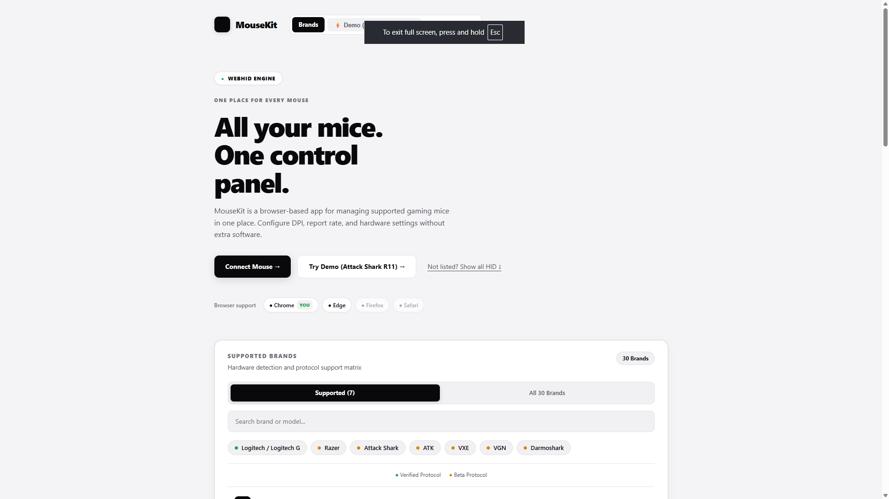
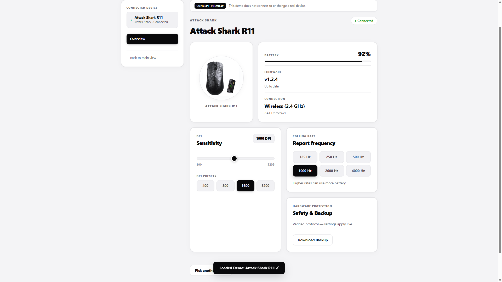

# 🖱️ MouseKit

> **All your mice. One control panel.**  
> A high-performance, browser-based WebHID application to configure gaming mouse DPI, report rates, and hardware protocols without bloatware or background services.

---

## 🌟 Overview

**MouseKit** brings hardware-level configuration directly to your web browser. Operating entirely over **WebHID**, it lets gamers and power users adjust DPI sensitivity, report frequency (polling rate), battery levels, and safety backups without installing proprietary manufacturer software or telemetry daemons.

- **Zero Installation**: No background drivers, no services, no telemetry.
- **Universal Hardware Support**: Hardware detection across 30 gaming mouse brands and custom protocols.
- **Live Interactive Demo**: Instant preview mode featuring the **Attack Shark R11** wireless gaming mouse.

---

## 📸 Screenshots

### 1. Main Landing Page & Brand Matrix


### 2. Control Panel Dashboard (Attack Shark R11 Interactive Demo)


---

## ✨ Features

- **⚡ DPI Sensitivity Control**: Live range slider with real-time value readouts and quick preset buttons (`400`, `800`, `1600`, `3200`).
- **🔄 Polling Rate / Report Frequency**: Segmented controls for `125Hz`, `250Hz`, `500Hz`, `1000Hz`, `2000Hz`, and `4000Hz`.
- **🔋 Battery & Device Diagnostics**: Live battery progress indicator (`92%`), firmware version verification, and 2.4 GHz wireless connection status.
- **🛡️ Hardware Protection & Backup**: Instant configuration snapshotting and one-click JSON backup/restore.
- **🎮 Interactive Demo Mode**: Try out the full 2-column control panel experience with the **Attack Shark R11** without needing a physical device connected.
- **🌐 30 Brand Protocols Supported**: Built-in support matrix for Logitech, Razer, Attack Shark, ATK, VXE, VGN, Darmoshark, Glorious, Pulsar, and more.

---

## 🚀 Quick Start

### Browser Requirements
Requires a WebHID-compatible browser:
- ✅ **Google Chrome** (v89+)
- ✅ **Microsoft Edge** (v89+)
- ❌ *Firefox & Safari currently do not support WebHID.*

### Running Locally

```bash
# Clone the repository
git clone https://github.com/AlibekIsomov/mouse-kit.git
cd mouse-kit

# Start the local server
npm start
```

Open `http://localhost:8080` in Chrome or Edge, click **Connect Mouse** or **⚡ Demo (Attack Shark R11)**, and start configuring!

---

## 🛠️ Architecture

```
mousekit/
├── public/
│   ├── index.html       # OpenMouse studio interface & dashboard
│   ├── style.css        # Whitish-gray studio light design tokens
│   ├── app.js           # WebHID connection & driver orchestration
│   ├── devices.js       # Brand vendor IDs & model database
│   ├── drivers.js       # USB WebHID protocol drivers
│   └── images.js        # Official product photo catalogue
├── assets/
│   ├── landing-hero.png # 16:9 Landing Page screenshot
│   └── dashboard-demo.png # 16:9 Attack Shark R11 Dashboard screenshot
├── server.js            # Hardened static file server (Node stdlib)
├── validate.js          # API validation & sanitization
└── README.md            # Project documentation
```

---

## 🛡️ Security & Privacy

- **Local Execution**: All WebHID communications stay strictly local between your browser and USB controller.
- **Content Security Policy (CSP)**: Strict CSP policy (`default-src 'none'; script-src 'self'; style-src 'self'`) prevents inline script injection and telemetry leaks.
- **Safety Consent**: Opt-in write safety verification prevents unintended EEPROM writes.

---

## 📄 License

This project is licensed under the [MIT License](LICENSE) © 2026 Alibek Isomov.
